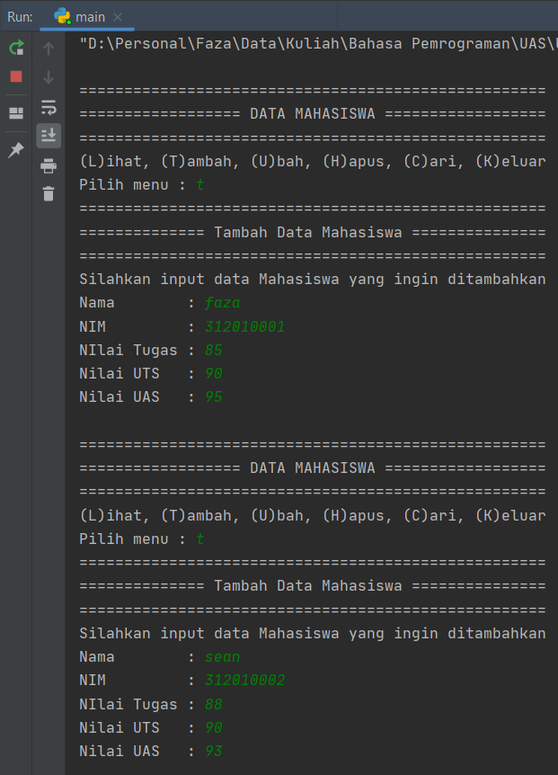

# UAS SEMESTER 1 BAHASA PEMROGRAMAN

Repository ini dibuat untuk memenuhi UAS Bahasa Pemrograman<br>

##SOAL

Berikut adalah tugas UAS yang diberikan<br>
<br>
Tugasnya adalah membuat program daftar nilai dengan package dan modul. Setelah selesai programnya kemudian dibuatkan **README.MD** yang berisi penjelasan dan screenshoot dari hasil program yang di buat.<br>

##JAWABAN
Pertama - tama saya buat dulu untuk direktorinya, yaitu ada 2 direktori. Direktori pertama dengan nama ***model*** yang berisi file python ***daftar_nilai.py***. Direktori kedua dengan nama view yang berisi 2 file python, ***yaitu input_nilai.py*** dan ***view_nilai.py***. Yang terakhir membuat file python ***main.py*** yang terletak diluar kedua direktori tersebut yang fungsinya sebagai program utama. Disini saya menggunakan dictionary dan fungsi<br>

<br>

* daftar_nilai.py<br>
Didalam daftar_nilai.py ini berisi modul untuk tambah, ubah, hapus dan cari data<br>
berikut source codenya :
```python
data = {}


def tambahdata():
    print("====================================================")
    print("============== Tambah Data Mahasiswa ===============")
    print("====================================================")
    print("Silahkan input data Mahasiswa yang ingin ditambahkan")


def hapus():
    print("==========================================================")
    print("================== Hapus Data Mahasiswa ==================")
    print("==========================================================")
    print("Silahkan masukkan Nama Mahasiswa yang akan dihapus datanya")
    nama = input(" Masukan Nama\t:")
    if nama in data.keys():
        del data[nama]
        print()
        print("==========================================================")
        print("================= BERHASIL MENGHAPUS DATA ================")
        print("==========================================================")
    else:
        print("Data {0} tidak ada".format(nama))


def ubah():
    print("=================================================")
    print("=========== Edit Data Nilai Mahasiswa ===========")
    print("=================================================")
    print("Silahkan masukkan Nama Mahasiswa yang akan diubah")
    nama = input("Masukan Nama\t\t: ")
    print("===============================")
    if nama in data.keys():
        nim = input("NIM baru\t\t\t: ")
        tugas = int(input("Nilai Tugas Baru\t: "))
        uts = int(input("Nilai UTS Baru\t\t: "))
        uas = int(input("Nilai UAS Baru\t\t: "))
        nilaiakhir = (tugas * 30 / 100 + uts * 35 / 100 + uas * 35 / 100)
        data[nama] = nim, tugas, uts, uas, nilaiakhir
        print()
        print("=================================================")
        print("============ BERHASIL MENGUBAH DATA =============")
        print("=================================================")
    else:
        print("Data nilai {0} tidak ada ".format(nama))


def cari():
    print("=============================================")
    print("========= Cari Data Nilai Mahasiswa =========")
    print("=============================================")
    print("Silahkan input Nama Mahsiswa yang akan dicari")

```

* input_nilai.py<br>
Untuk input nilai di dalamnya berisi input data yang meminta pengguna memasukkan data<br>
berikut source codenya :<br>
```python
from model.daftar_nilai import data


def inputdata():
    nama = input("Nama\t\t: ")
    nim = int(input("NIM\t\t\t: "))
    tugas = int(input("NIlai Tugas\t: "))
    uts = int(input("Nilai UTS\t: "))
    uas = int(input("Nilai UAS\t: "))
    nilaiakhir = (tugas * 0.3 + uts * 0.35 + uas * 0.35)
    data[nama] = nim, tugas, uts, uas, nilaiakhir

```
dikarenakan sudah beda file, maka kita harus import data dictionary yang ada pada file ***daftar_nilai.py***, karena disini saya menggunakan dictionary. Cara memanngilnya dengan syntax :<br>
```python
from model.daftar_nilai import data
```
syntax tersebut berfungsi untuk memanggil data dictonary yang ada pada file ***daftar_nilai.py***<br>

* view_nilai.py<br>
Pada file ini berisi source code untuk menampilkan data dan hasil pencarian. Berikut source codenya :
```python
from model.daftar_nilai import data


    
def tampilkan():
    if data.items():
        print("")
        print("======================================================================================")
        print("================================== Daftar Nilai ======================================")
        print("======================================================================================")
        print("|  No  |      NAMA     |      NIM      |   TUGAS  |   UTS   |   UAS   | NILAI AKHIR  |")
        print("======================================================================================")
        i: int = 0
        for a in data.items():
            i += 1
            print(
                f"| {i:4} | {a[0]:13s} | {a[1][0]:13} | {a[1][1]:8d} |  {a[1][2]:6d} | {a[1][2]:7d} |    {a[1][4]:6.2f}    | ")
            print("======================================================================================")
    else:
        print("")
        print("======================================================================================")
        print("===================================== Daftar Nilai ===================================")
        print("======================================================================================")
        print("|  No  |      NAMA     |      NIM      |   TUGAS  |   UTS   |   UAS   | NILAI AKHIR  |")
        print("======================================================================================")
        print("|                                    Tidak Ada Data                                  |")
        print("======================================================================================")


def tampilkancari():
    nama = input("Masukan Nama\t: ")
    if nama in data.keys():
        print("==================================================================================")
        print("================================= Daftar Nilai ===================================")
        print("==================================================================================")
        print("====================| NAMA | (NIM, TUGAS, UTS, UAS, NILAI AKHIR) |================")
        print("==================================================================================")
        print("                    | {0} | {1} | ".format(nama, data[nama]))
        print("==================================================================================")
    else:
        print("Datanya {0} tidak ada ".format(nama))
```
Karena data yang ada berada pada file daftar_nilai.py maka kita juga harus memanggilnya, dengan syntax :
```python
from model.daftar_nilai import data
```

* main.py<br>
Didalam file ini bereisi program utamanya, yaitu untuk memanggil fungsi - fungsi yang berada di ***daftar_nilai.py, input_nilai.py dan view_nilai.py***. Berikut source codenya 
```python
from model.daftar_nilai import ubah, hapus, cari, tambahdata
from view.input_nilai import inputdata
from view.view_nilai import tampilkan, tampilkancari

while True:
    print("")
    print("====================================================")
    print("================== DATA MAHASISWA ==================")
    print("====================================================")
    x = input("(L)ihat, (T)ambah, (U)bah, (H)apus, (C)ari, (K)eluar \nPilih menu : ")
    if x.lower() == "l":
        tampilkan()
    elif x.lower() == "t":
        tambahdata()
        inputdata()
    elif x.lower() == "u":
        ubah()
    elif x.lower() == "h":
        hapus()
    elif x.lower() == "c":
        cari()
        tampilkancari()
    elif x.lower() == "k":
        print()
        print("=================================")
        print("====== KELUAR DARI PROGRAM ======")
        print("=================================")
        break

    else:
        print()
        print("==================================")
        print("== Pilihan Anda Tidak Tersedia ==")
        print("== Pilihlah Menu Yang Tersedia ==")
        print("==================================")

```
Karena disini memanggil fungsi dari ***daftar_nilai.py, input_nilai.py dan view_nilai.py***, maka kita perlu import, source codenya :
```python
from model.daftar_nilai import ubah, hapus, cari, tambahdata
from view.input_nilai import inputdata
from view.view_nilai import tampilkan, tampilkancari
```
Dari source code tersebut, maksudnya adalah <br>
from dari mana filenya, lalu letak folder/package, titik lalu nama file, import, setelah itu fungsi apa saja yang ingin di import dari file tersebut<br>
contoh : from model.daftar_nilai import ubah, hapus, cari, tambahdata
Disini saya mengambil dari folder/package model, dengan file daftar_nilai.py, dan yang saya import adalah fungsi ubah, hapus, cari, tambahdata<br>

Dari semua itu, maka outputnya adalah :<br>

* Tambah Data<br>
<br>

* Lihat data yang sudah diinput<br>
.png)<br>

* Lihat data kosong<br>
.png)<br>

* Ubah data<br>
<br>
setelah merubah data maka di cek lagi<br>
